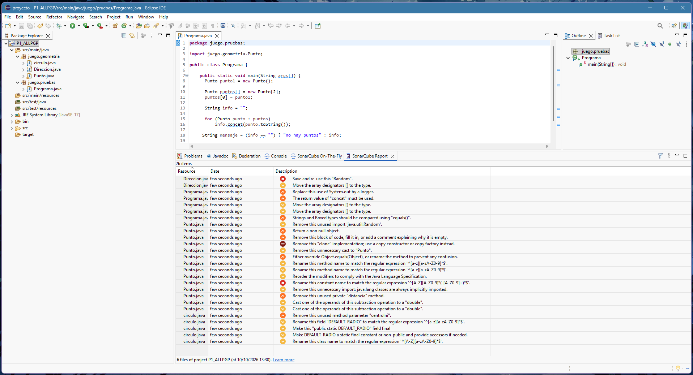

# Práctica 1 — Revisiones estáticas de código con SonarQube for Eclipse

## Índice

- [1. Miembros del grupo](#1-miembros-del-grupo)
- [2. Análisis inicial](#2-análisis-inicial)
- [3. Disconformidades detectadas](#3-disconformidades-detectadas)
- [4. Soluciones adoptadas](#4-soluciones-adoptadas)
- [5. Resumen de las correcciones](#5-resumen-de-las-correcciones)
- [6. Análisis final](#6-análisis-final)
- [7. Proyecto final](#7-proyecto-final)
- [8. Comprobación de la entrega](#8-comprobación-de-la-entrega)

## 1. Miembros del grupo

| Miembro | Nombre y apellidos |
|---|---|
| Alumno/a 1 | ÁLVARO LARA LARA |
| Alumno/a 2 | PABLO GARCÍA PÉREZ |

**Nombre del proyecto Eclipse:** `P1_ALLPGP`

---

## 2. Análisis inicial

Antes de realizar ninguna modificación sobre el código proporcionado se ha ejecutado el análisis estático del proyecto utilizando **SonarQube for Eclipse** con su configuración por defecto.

### Captura inicial



---

## 3. Disconformidades detectadas

En el análisis inicial se han identificado las siguientes disconformidades:

| Nº | Regla Sonar | Archivo | Línea | Disconformidad |
|---:|---|---|---:|---|
| 1 | `java:S2119` | `Direccion.java` | 22 | Save and re-use this "Random" |
| 2 | `java:S1197` | `Direccion.java` | 21 | Move the array designators `[]` to the type |
| 3 | `java:S106` | `Programa.java` | 19 | Replace this use of System.out by a logger |
| 4 | `java:S1481` | `Programa.java` | 15 | The return value of "concat" must be used |
| 5 | `java:S1197` | `Programa.java` | 8 | Move the array designators `[]` to the type |
| 6 | `java:S1197` | `Programa.java` | 8 | Move the array designators `[]` to the type |
| 7 | `java:S4973` | `Programa.java` | 17 | Strings and Boxed types should be compared using "equals()" |
| 8 | `java:S1128` | `Punto.java` | 4 | Remove this unused import 'java.util.Random' |
| 9 | `java:S1168` | `Punto.java` | 91 | Return a non null object |
| 10 | `java:S108` | `Punto.java` | 113 | Remove this block of code, fill it in, or add a comment explaining why it is empty |
| 11 | `java:S2975` | `Punto.java` | 119 | Remove this "clone" implementation; use a copy constructor or copy factory instead |
| 12 | `java:S1905` | `Punto.java` | 121 | Remove this unnecessary cast to "Punto" |
| 13 | `java:S1206` | `Punto.java` | 108 | Either override Object.equals(Object), or rename the method to prevent any confusion |
| 14 | `java:S100` | `Punto.java` | 77 | Rename this method name to match the regular expression '^[a-z][a-zA-Z0-9]*$' |
| 15 | `java:S100` | `Punto.java` | 42 | Rename this method name to match the regular expression '^[a-z][a-zA-Z0-9]*$' |
| 16 | `java:S1124` | `Punto.java` | 7 | Reorder the modifiers to comply with the Java Language Specification |
| 17 | `java:S115` | `Punto.java` | 5 | Rename this constant name to match the regular expression '^[A-Z][A-Z0-9]*(_[A-Z0-9]+)*$' |
| 18 | `java:S1128` | `Punto.java` | 3 | Remove this unnecessary import: java.lang classes are always implicitly imported |
| 19 | `java:S1068` | `Punto.java` | 99 | Remove this unused private "distancia" method |
| 20 | `java:S1640` | `Punto.java` | 116 | Cast one of the operands of this subtraction operation to a "double" |
| 21 | `java:S1640` | `Punto.java` | 115 | Cast one of the operands of this subtraction operation to a "double" |
| 22 | `java:S1172` | `circulo.java` | 11 | Remove this unused method parameter "centroIni" |
| 23 | `java:S116` | `circulo.java` | 5 | Rename this field "DEFAULT_RADIO" to match the regular expression '^[a-z][a-zA-Z0-9]*$' |
| 24 | `java:S1444` | `circulo.java` | 5 | Make this "public static DEFAULT_RADIO" field final |
| 25 | `java:S1104` | `circulo.java` | 5 | Make DEFAULT_RADIO a static final constant or non-public and provide accessors if needed |
| 26 | `java:S100` | `circulo.java` | 3 | Rename this class name to match the regular expression '^[A-Z][a-zA-Z0-9]*$' |

---

## 4. Soluciones adoptadas

### Disconformidad 1 — `java:S2119`

**Localización:** `Direccion.java`, línea 22
**Responsable:** ÁLVARO LARA LARA

**Problema detectado**

Se crea un nuevo objeto `Random` en cada llamada al método `aleatoria()`.

**Solución adoptada**

Extraer el objeto `Random` como constante estática de la clase

### Disconformidad 2 — `java:S1197`

**Localización:** `Direccion.java`, línea 21
**Responsable:** ÁLVARO LARA LARA

**Problema detectado**

Los corchetes del array están después del nombre de la variable en lugar del tipo.

**Solución adoptada**

Mover los corchetes [] al tipo de la variable.

### Disconformidad 3 — `java:S106`

**Localización:** `Programa.java`, línea 19
**Responsable:** ÁLVARO LARA LARA

**Problema detectado**

Uso de System.out.println en lugar de un logger.

**Solución adoptada**

Sustituir System.out.println por un Logger.

### Disconformidad 4 — `java:S1481`

**Localización:** `Programa.java`, línea 15
**Responsable:** ÁLVARO LARA LARA

**Problema detectado**

El valor devuelto por String.concat() no se asigna a ninguna variable.

**Solución adoptada**

Asignar el resultado del concat a la variable info.

### Disconformidad 5 — `java:S1197`

**Localización:** `Programa.java`, línea 8
**Responsable:** ÁLVARO LARA LARA

**Problema detectado**

Los corchetes del array están después del nombre de la variable.

**Solución adoptada**

Mover los corchetes [] al tipo de la variable.

### Disconformidad 6 — `java:S4973`

**Localización:** `Programa.java`, línea 17
**Responsable:** ÁLVARO LARA LARA

**Problema detectado**

Comparación de cadenas usando == en lugar de .equals().

**Solución adoptada**

Usar .equals() o .isEmpty() para comparar cadenas.

### Disconformidad 7 — `java:S1128`

**Localización:** `Punto.java`, línea 4
**Responsable:** ÁLVARO LARA LARA

**Problema detectado**

Import java.util.Random no utilizado.

**Solución adoptada**

Eliminar la línea de import innecesaria.

### Disconformidad 8 — `java:S1168`

**Localización:** `Punto.java`, línea 91
**Responsable:** ÁLVARO LARA LARA

**Problema detectado**

El método desplazar(Direccion) devuelve null en el default del switch.

**Solución adoptada**

Lanzar una excepción en lugar de devolver null.

### Disconformidad 8 — `java:S1168`

**Localización:** `Punto.java`, línea 91
**Responsable:** ÁLVARO LARA LARA

**Problema detectado**

El método desplazar(Direccion) devuelve null en el default del switch.

**Solución adoptada**

Lanzar una excepción en lugar de devolver null.

### Disconformidad 9 — `java:S108`

**Localización:** `Punto.java`, línea 142
**Responsable:** ÁLVARO LARA LARA

**Problema detectado**

Bloque catch vacío en el método clone().

**Solución adoptada**

Rellenar el bloque catch con una excepción o un comentario justificativo.

### Disconformidad 10 — `java:S1206`

**Localización:** `Punto.java`, línea 125
**Responsable:** ÁLVARO LARA LARA

**Problema detectado**

El método equals(Punto) no sobrescribe Object.equals(Object).

**Solución adoptada**

Rellenar el bloque catch con una excepción o un comentario justificativo.Cambiar la firma a equals(Object obj) y añadir @Override.

### Disconformidad 11 — `java:S1124`

**Localización:** `Punto.java`, línea 10
**Responsable:** ÁLVARO LARA LARA

**Problema detectado**

Los modificadores public final static están en orden incorrecto.

**Solución adoptada**

Reordenar los modificadores a public static final.

### Disconformidad 12 — `java:S1124`

**Localización:** `Punto.java`, línea 10
**Responsable:** ÁLVARO LARA LARA

**Problema detectado**

El nombre de la constante defaultValue no sigue la convención (debe ser mayúsculas).

**Solución adoptada**

Renombrar a DEFAULT_VALUE.

---

## 5. Resumen de las correcciones

| Nº | Regla Sonar | Responsable | Commit | Resultado |
|---:|---|---|---|---|
| 1 | `java:SXXXX` | Nombre y apellidos | `abcdef1` | Resuelta |
| 2 | `java:SXXXX` | Nombre y apellidos | `abcdef2` | Resuelta |
| 3 | `java:SXXXX` | Nombre y apellidos | `abcdef3` | Resuelta |

---

## 6. Análisis final

Una vez realizadas todas las modificaciones se ha vuelto a ejecutar el análisis del proyecto completo con **SonarQube for Eclipse**.

### Captura final


La captura final permite comprobar que se está analizando el mismo proyecto utilizado en la captura inicial y que ya no quedan disconformidades pendientes.

---

## 7. Proyecto final

La versión final del proyecto Eclipse se encuentra en:

```text
P1/proyecto/P1_ALLPGP/
```

El proyecto incluido en esta carpeta contiene las modificaciones correspondientes a las soluciones documentadas anteriormente y coincide con la versión sobre la que se ha realizado la captura final.

---

## 8. Comprobación de la entrega

- [ ] El nombre del proyecto sigue el formato establecido: `P1_ALLPGP`.
- [ ] Se identifican los dos miembros del grupo.
- [ ] Se incluye la captura del análisis inicial.
- [ ] Se han documentado todas las disconformidades inicialmente detectadas.
- [ ] Cada solución está asociada a un commit identificable en `main`.
- [ ] Se identifica qué miembro del grupo realizó cada corrección.
- [ ] Los dos miembros han participado mediante commits propios.
- [ ] Se incluye la captura del análisis final.
- [ ] La captura final permite comprobar que no quedan disconformidades.
- [ ] Se ha incorporado el proyecto Eclipse final dentro de `P1/proyecto/`.
- [ ] El proyecto final corresponde al código analizado en la captura final.
