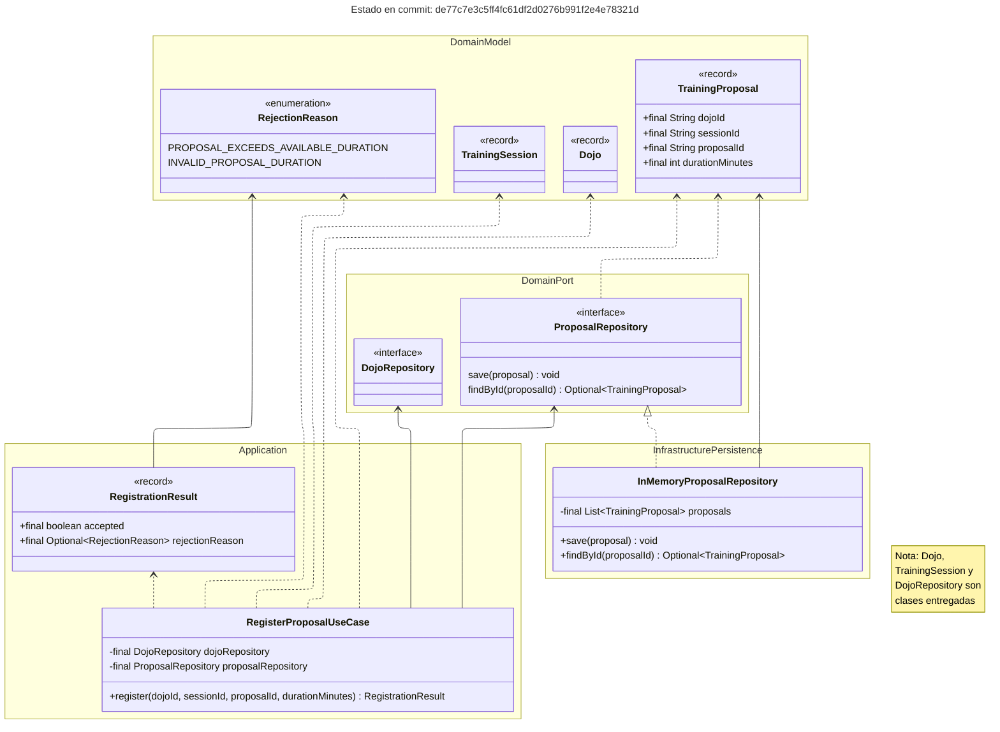

```mermaid
---
title: "Estado en commit: de77c7e3c5ff4fc61df2d0276b991f2e4e78321d"
config:
  layout: elk
---
classDiagram
  direction BT

  namespace DomainModel {
    class RejectionReason {
      <<enumeration>>

      PROPOSAL_EXCEEDS_AVAILABLE_DURATION
      INVALID_PROPOSAL_DURATION
    }
    
    class TrainingProposal {
      <<record>>

      +final String dojoId
      +final String sessionId
      +final String proposalId
      +final int durationMinutes
    }

    class Dojo {
      <<record>>
    }

    class TrainingSession {
      <<record>>
    }
  }

  namespace DomainPort {
    class ProposalRepository {
      <<interface>>

      save(proposal) void
      findById(proposalId) Optional~TrainingProposal~
    }

    class DojoRepository {
      <<interface>>
    }
  }

  ProposalRepository ..> TrainingProposal

  namespace Application {
    class RegisterProposalUseCase {
      -final DojoRepository dojoRepository
      -final ProposalRepository proposalRepository
      
      +register(dojoId, sessionId, proposalId, durationMinutes) RegistrationResult
    }

    class RegistrationResult {
      <<record>>

      +final boolean accepted
      +final Optional~RejectionReason~ rejectionReason
    }
  }

  RegisterProposalUseCase ..> Dojo
  RegisterProposalUseCase ..> RejectionReason
  RegisterProposalUseCase ..> TrainingProposal
  RegisterProposalUseCase ..> TrainingSession
  RegisterProposalUseCase --> DojoRepository
  RegisterProposalUseCase --> ProposalRepository
  RegisterProposalUseCase ..> RegistrationResult

  RegistrationResult --> RejectionReason

  namespace InfrastructurePersistence {
    class InMemoryProposalRepository {
      -final List~TrainingProposal~ proposals

      +save(proposal) void
      +findById(proposalId) Optional~TrainingProposal~
    }
  }

  InMemoryProposalRepository --> TrainingProposal
  InMemoryProposalRepository ..|> ProposalRepository

  note "Nota: Dojo,<br>TrainingSession y<br>DojoRepository son<br>clases entregadas"
```