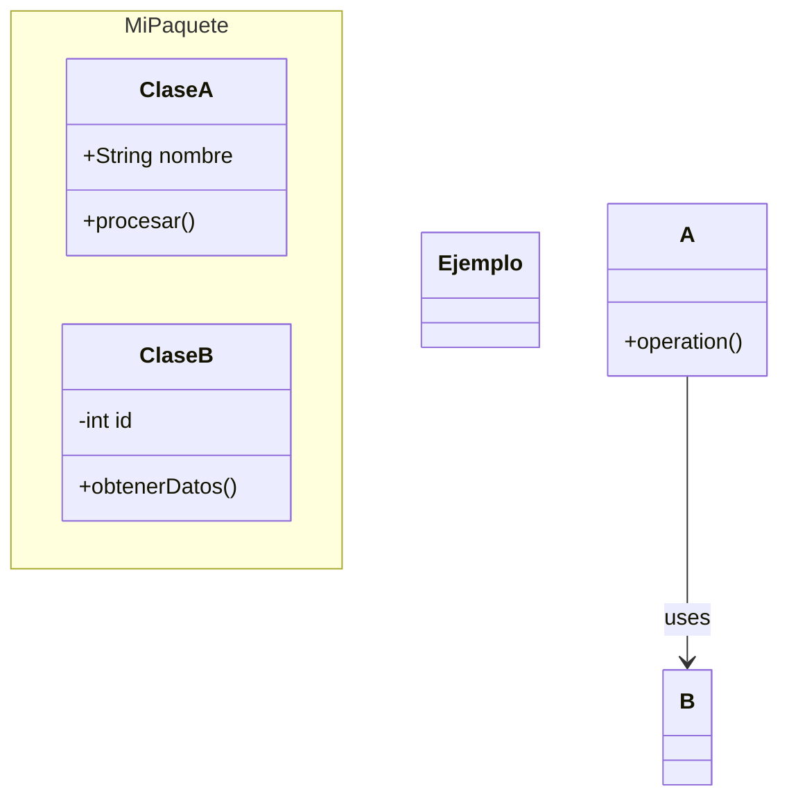

```mermaid
classDiagram
	class Ejemplo {}

  class A {
    +operation()
  }
  class B
  A --> B : uses

  namespace MiPaquete {
    class ClaseA {
      +String nombre
      +procesar()
    }
    class ClaseB {
      -int id
      +obtenerDatos()
    }
  }
  
```