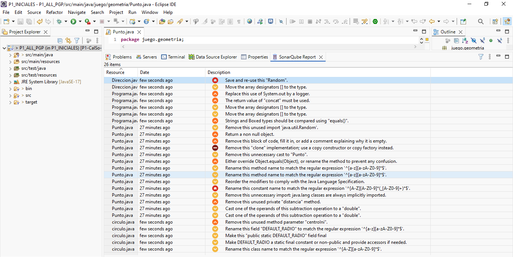

 Práctica 1 — Revisiones estáticas de código con SonarQube for Eclipse

## 1. Miembros del grupo

| Miembro | Nombre y apellidos |
|---|---|
| Alumno/a 1 | ÁLVARO LARA LARA |
| Alumno/a 2 | PABLO GARCÍA PÉREZ |

**Nombre del proyecto Eclipse:** `P1_ALL_PGP`

## 2. Análisis inicial

Antes de realizar ninguna modificación sobre el código proporcionado se ha ejecutado el análisis estático del proyecto utilizando **SonarQube for Eclipse** con su configuración por defecto.

### Captura inicial
 

 ## 3. Disconformidades detectadas

En el análisis inicial se han identificado las siguientes disconformidades:

| Nº | Regla Sonar | Archivo | Línea | Disconformidad |
|---:|---|---|---:|---|
| 1 | `java:S2119` | `Direccion.java` | 22 | Save and re-use this "Random" |
| 2 | `java:S1197` | `Direccion.java` | 21 | Move the array designators `[]` to the type |
| 3 | `java:S106` | `Programa.java` | 19 | Replace this use of System.out by a logger |
| 4 | `java:S1481` | `Programa.java` | 15 | The return value of "concat" must be used |
| 5 | `java:S1197` | `Programa.java` | 8 | Move the array designators `[]` to the type |
| 6 | `java:S1197` | `Programa.java` | 8 | Move the array designators `[]` to the type |
| 7 | `java:S4973` | `Programa.java` | 17 | Strings and Boxed types should be compared using "equals()" |
| 8 | `java:S1128` | `Punto.java` | 4 | Remove this unused import 'java.util.Random' |
| 9 | `java:S1168` | `Punto.java` | 91 | Return a non null object |
| 10 | `java:S108` | `Punto.java` | 113 | Remove this block of code, fill it in, or add a comment explaining why it is empty |
| 11 | `java:S2975` | `Punto.java` | 119 | Remove this "clone" implementation; use a copy constructor or copy factory instead |
| 12 | `java:S1905` | `Punto.java` | 121 | Remove this unnecessary cast to "Punto" |
| 13 | `java:S1206` | `Punto.java` | 108 | Either override Object.equals(Object), or rename the method to prevent any confusion |
| 14 | `java:S100` | `Punto.java` | 77 | Rename this method name to match the regular expression '^[a-z][a-zA-Z0-9]*$' |
| 15 | `java:S100` | `Punto.java` | 42 | Rename this method name to match the regular expression '^[a-z][a-zA-Z0-9]*$' |
| 16 | `java:S1124` | `Punto.java` | 7 | Reorder the modifiers to comply with the Java Language Specification |
| 17 | `java:S115` | `Punto.java` | 5 | Rename this constant name to match the regular expression '^[A-Z][A-Z0-9]*(_[A-Z0-9]+)*$' |
| 18 | `java:S1128` | `Punto.java` | 3 | Remove this unnecessary import: java.lang classes are always implicitly imported |
| 19 | `java:S1068` | `Punto.java` | 99 | Remove this unused private "distancia" method |
| 20 | `java:S1640` | `Punto.java` | 116 | Cast one of the operands of this subtraction operation to a "double" |
| 21 | `java:S1640` | `Punto.java` | 115 | Cast one of the operands of this subtraction operation to a "double" |
| 22 | `java:S1172` | `circulo.java` | 11 | Remove this unused method parameter "centroIni" |
| 23 | `java:S116` | `circulo.java` | 5 | Rename this field "DEFAULT_RADIO" to match the regular expression '^[a-z][a-zA-Z0-9]*$' |
| 24 | `java:S1444` | `circulo.java` | 5 | Make this "public static DEFAULT_RADIO" field final |
| 25 | `java:S1104` | `circulo.java` | 5 | Make DEFAULT_RADIO a static final constant or non-public and provide accessors if needed |
| 26 | `java:S100` | `circulo.java` | 3 | Rename this class name to match the regular expression '^[A-Z][a-zA-Z0-9]*$' |

---

## 4. Soluciones adoptadas

### Disconformidad 1 — `java:S2119`

**Localización:** `Direccion.java`, línea 22
**Responsable:** ÁLVARO LARA LARA

**Problema detectado**

Se crea un nuevo objeto `Random` en cada llamada al método `aleatoria()`.

**Solución adoptada**

Extraer el objeto `Random` como constante estática de la clase

### Disconformidad 2 — `java:S1197`

**Localización:** `Direccion.java`, línea 21
**Responsable:** ÁLVARO LARA LARA

**Problema detectado**

Los corchetes del array están después del nombre de la variable en lugar del tipo.

**Solución adoptada**

Mover los corchetes [] al tipo de la variable.

### Disconformidad 3 — `java:S106`

**Localización:** `Programa.java`, línea 19
**Responsable:** ÁLVARO LARA LARA

**Problema detectado**

Uso de System.out.println en lugar de un logger.

**Solución adoptada**

Sustituir System.out.println por un Logger.

### Disconformidad 4 — `java:S1481`

**Localización:** `Programa.java`, línea 15
**Responsable:** ÁLVARO LARA LARA

**Problema detectado**

El valor devuelto por String.concat() no se asigna a ninguna variable.

**Solución adoptada**

Asignar el resultado del concat a la variable info.